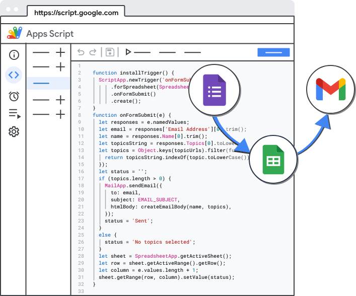

# Automatiza y extiende Google Workspace con código sencillo

Apps Script es una plataforma de **JavaScript** basada en la nube con la tecnología de Google Drive que te permite integrar y automatizar tareas en los productos de Google.

## Qué puede hacer Apps Script?

Apps Script es versátil. Estas son algunas de las acciones que puedes hacer en él:

- Agrega menús personalizados, diálogos y barras laterales a Documentos, Hojas de cálculo y Formularios de Google.
- Escribir funciones personalizadas y macros para Hojas de cálculo de Google
- Publica apps web, ya sean independientes o incorporadas en Google Sites.
- Interactuar con otros servicios de Google, como AdSense, Analytics, Calendario, Drive, Gmail y Maps
- Compila complementos y publícalos en Google Workspace Marketplace.

## Docs

- [Apps Script](https://script.google.com)
- [Google Workspace](https://developers.google.com/apps-script)
